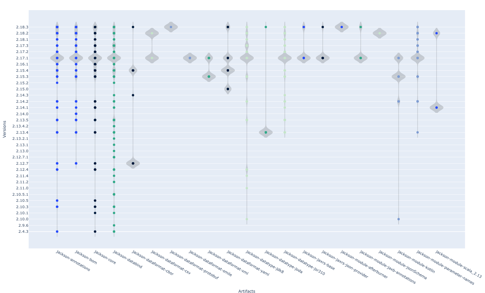
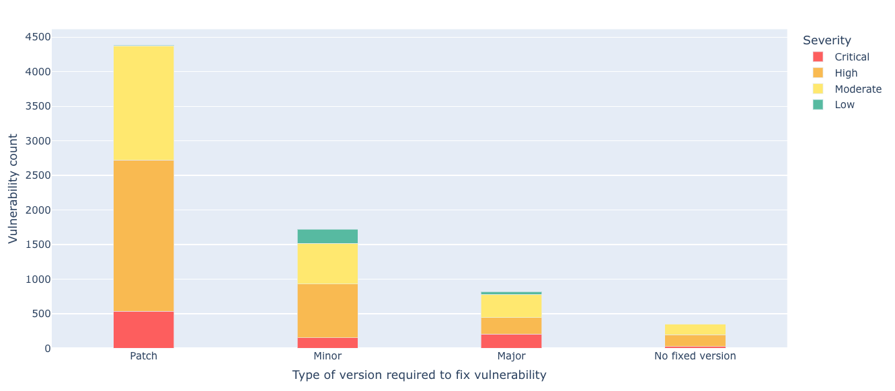

import ReactPlayer from 'react-player';

# Proof of value process

With Moderne, you can automate maintenance processes such as framework migrations, security vulnerability fixes, and code quality standardization. Code refactoring work that used to take months and teams of developers can be done in minutes, closing vulnerabilities and saving millions of dollars in software maintenance costs while giving developers substantially more time to focus on delivering business value.

We are often asked how to introduce the power of Moderne to an organization in order to build confidence in the tooling and facilitate a successful paradigm shift for their teams. To start, it's best to focus on lower risk, lower effort, and lower complexity tasks for developers. This might include tasks such as cleaning up code quality issues or addressing isolated CVEs. Once success is shown in these areas, you can build up to more substantial updates, such as minor framework updates or patches, and eventually to more complex code migration work.

The idea is for all of these types of updates to become a continuous process for your organization. Gradually phasing them in over time helps to achieve both technological and cultural change, which ultimately drives adoption.

## Proof of value (POV) Steps

1. The process kicks off by us provisioning an isolated Moderne Platform in the cloud provider and region of your choice. Deployment is fully automated and takes approximately one hour.
2. After that, you'll need to set up the agent. Please follow the instructions in our [on-premise agent configuration doc](../how-to-guides/agent-configuration/agent-config.md). The agent is a single docker image or JAR that can run on a Virtual Machine, Kubernetes, or Cloud Foundry. It controls the encryption key and connects to on-prem systems such as your source code manager (SCM) and artifact repository. To ensure the agent functions correctly, you will need to create a read-only service account for your artifact repository and your SCM. This will allow developers to authenticate with your SCM for access control and commits/PRs (if commits are enabled for your tenant). The installation process typically takes less than an hour once the service accounts and SCM configurations are in place.
3. To enable SSO for Moderne, you will need to connect to your Identity Provider (IdP). This is done in a 30-minute meeting with Moderne to exchange metadata. If requested, a username/password can also be used during the POV process instead of SSO.
4. Next, you'll need to [set up the ingestion pipeline](../how-to-guides/mass-ingest.md). This pipeline will build and publish LST artifacts for the repositories you specify to your artifact repository. From there, the Moderne agent will find these LST artifacts, encrypt them, and ship them to the Moderne cloud.
   * The more repositories you add and the more diverse they are, the easier it is to demonstrate value. Customers typically start with 50-100 repositories.
   * No changes are required to the repositories themselves (such as installing build plugins).
5. With all of that done, you're now ready to run some recipes. Below, we'll provide some suggestions for recipes to run. The links will take you to the [Moderne SaaS](https://app.moderne.io) where you can run the recipes on a variety of open-source repositories. You will need to sign in to view and run recipes.
6. After you run recipes, you'll generate some [data tables](../../../user-documentation/moderne-platform/getting-started/data-tables.md) and some [visualizations](../../../user-documentation/moderne-platform/getting-started/visualizations.md).

### Recipes to run

_Ordered from least complex to most complex_

* [Common static analysis fixes](https://app.moderne.io/recipes/org.openrewrite.staticanalysis.CommonStaticAnalysis)
  * Improve code quality and readability
  * Fix common mistakes
  * Eliminate legacy patterns and minor performance issues
* SLF4J Logging best practices
  * [Improve performance](https://app.moderne.io/recipes/org.openrewrite.java.logging.slf4j.ParameterizedLogging) by preferring parameterized logging to string concatenation
  * [Improve error reporting](https://app.moderne.io/recipes/org.openrewrite.java.logging.slf4j.CompleteExceptionLogging) by using exception-specialized logging invocations where applicable
*   Maven dependency management

    * [Upgrade Maven dependencies](https://app.moderne.io/recipes/org.openrewrite.maven.UpgradeDependencyVersion) to keep dependencies patched and up-to-date
    * [Exclude test dependencies](https://app.moderne.io/recipes/org.openrewrite.maven.ExcludeDependency) like JUnit from the compile scope
    * [Remove redundant explicit dependency versions](https://app.moderne.io/recipes/org.openrewrite.maven.RemoveRedundantDependencyVersions) to clean up Maven POMs
    * [Dependency insight for Gradle and Maven](https://app.moderne.io/recipes/org.openrewrite.java.dependencies.DependencyInsight)

    
* Gradle wrapper and plugin upgrades
  * [Update Gradle Wrapper](https://app.moderne.io/recipes/org.openrewrite.gradle.UpdateGradleWrapper) to keep Gradle itself up to date
  * [Update Gradle Plugin](https://app.moderne.io/recipes/org.openrewrite.gradle.plugins.UpgradePluginVersion) to keep build plugins up to date
*   Security enhancements and discovery
    * [Find secrets](https://app.moderne.io/recipes/org.openrewrite.java.security.secrets.FindSecrets) like passwords, encryption keys, access tokens
    * [Use secure random number generation](https://app.moderne.io/recipes/org.openrewrite.java.security.SecureRandom)
    * [Java security best practices](https://app.moderne.io/recipes/org.openrewrite.java.security.JavaSecurityBestPractices)
    * [OWASP Top 10](https://app.moderne.io/recipes/org.openrewrite.java.security.OwaspTopTen)
    * [Find and fix vulnerable dependencies](https://app.moderne.io/recipes/org.openrewrite.java.dependencies.DependencyVulnerabilityCheck)

    
* Modernize test frameworks
  * [JUnit 5 best practices](https://app.moderne.io/recipes/org.openrewrite.java.testing.junit5.JUnit5BestPractices)
  * [Mockito 1 to 5 migration](https://app.moderne.io/recipes/org.openrewrite.java.testing.mockito.Mockito1to5Migration)
  * [Migrate JUnit assertions to AssertJ](https://app.moderne.io/recipes/org.openrewrite.java.testing.assertj.Assertj) improved readability and consistency over stock JUnit assertions
* Major migrations
  * [Java 8 to 11](https://app.moderne.io/recipes/org.openrewrite.java.migrate.Java8toJava11)
  * [Java 11 to 21](https://app.moderne.io/recipes/org.openrewrite.java.migrate.UpgradeToJava21)
  * [Spring Boot 1 to 2](https://app.moderne.io/recipes/org.openrewrite.java.spring.boot2.UpgradeSpringBoot_2_7)
  * [Spring Boot 3.4 best practices](https://app.moderne.io/recipes/io.moderne.recipe.spring.boot3.SpringBoot3BestPractices)
* Custom migrations. Custom recipes can be developed to help with internal platform API management, EJB to Spring migrations, etc.

Major migrations are complex transformations consisting of multiple individual recipes. At some point, these transformations represent one-off use cases and there are diminishing returns from trying to automate them fully. Mostly, they will lift your applications 80-90% of the way to completion with the remainder requiring some manual actions expected to be taken by developers.

### Impact analysis

Another substantial use case worth testing is impact analysis. When adding new functionality or fixing a bug, it's often times good to think about what the consequences would be. While you _could_ make a change and see who yells at you, it's generally better if you take the time to do your due diligence and figure out what's going to happen.

Below are some recipes that you can use to help you with impact analysis as well as a detailed video that will walk you through using these recipes.

<ReactPlayer className="reactPlayer" url='https://youtu.be/jMxSWB5jJ5M?t=306' controls="true" />

#### Recipes to run

* [Find method usages](https://app.moderne.io/recipes/org.openrewrite.java.search.FindMethods)
* [Find types](https://app.moderne.io/recipes/org.openrewrite.java.search.FindTypes)
* [Dependency insight for Gradle and Maven](https://app.moderne.io/recipes/org.openrewrite.java.dependencies.DependencyInsight)
* [Update Gradle or Maven dependency versions](https://app.moderne.io/recipes/org.openrewrite.java.dependencies.UpgradeDependencyVersion)
